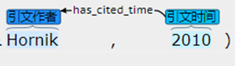
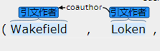
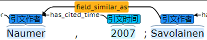
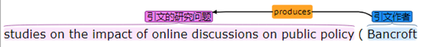
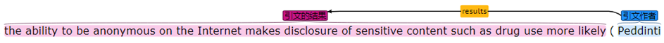
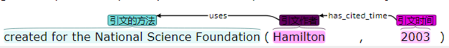
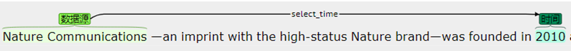
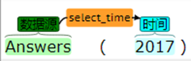
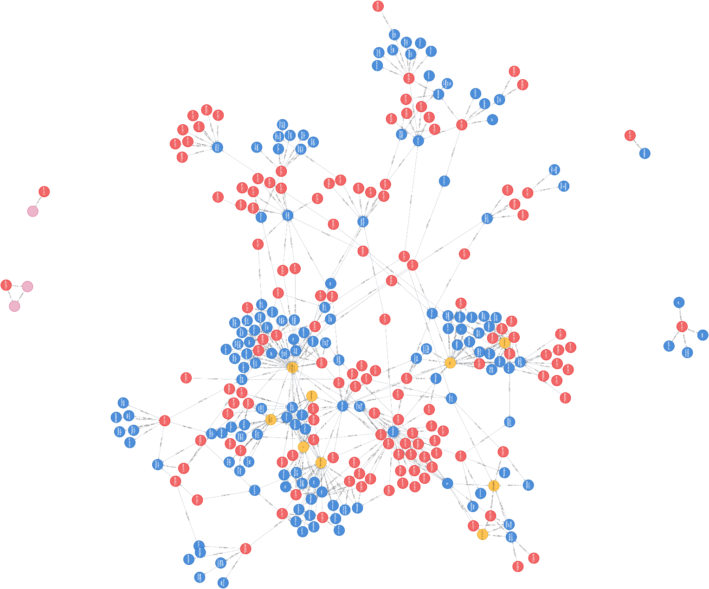

### Knowledge Graph：

"Entity-relationship" knowledge graph based on Linked Data.

### 知识图谱

基于关联数据的“实体-关系”知识图谱。

### Entity

**（1）Research Questions**

Research problem refers to the problem that the article aims to solve. The research question here refers to the sentence indicating the literature research question in the academic full-text.

 

```
Example1:10.1002/asi.22617-2-24 Now , we come to the main point of our article , namely , the relation between the h-index h and the impact factor IF ( average number of citations per publication ) in the shifted Lotka model .

Example2:10.1002/asi.22618-1-8 The purpose of this article is to report the development and the evaluation of an automated semantic annotation system ( called CharaParser ) that is designed to overcome the scalability problem in manual annotation and to promote adaptability of the system across various taxon groups .

Example3:10.1002/asi.22622-1-12 This article focuses on these ill-defined information contexts <cit> , where it aims at presenting a method and tool for information slaves to become emancipated from masters ' attempts to dictate a truth .
```

 

**（2）Research Methods**

Research methods refer to methods, tools, means, technologies, and solutions for solving problems in the application field. The research method here refers to the sentence indicating the literature research method in the academic full-text.

 

```
Examples1:10.1002/asi.22638-2-9 Another approach is to focus on a small subset of websites to build a linking subgraph based on the small websites subset as vertices , and specifying the edges between these websites

Examples2:110.1002/asi.22620-2-37 The visibility of the articles was analysed through a normalization of the citation per paper .

Examples3:110.1002/asi.22620-2-6 Topic searches are a common technique used to analyse growth and trends in the scientific literature of specific subject areas .
```

 

**（3）Research Results**

The research results refer to the results and conclusions drawn from the experiment in the article. The research results here refer to the sentences that indicate the literature research results in the academic full-text.

 

```
Examples1:110.1002/asi.22617-4-2 In this article , we presented , based on a shifted power model , an implicit relation between the h-index and the total number of sources , and between the h-index and the impact factor ( average number of items per source ) .

Examples2:110.1002/asi.22617-4-3 In this way , we extended earlier work to the case that the impact factor can have a value lower than one .

Examples3:110.1002/asi.22617-4-4 Although the relation between the h-index and the impact factor looks roughly linear , their relation ( in the shifted power model ) is not linear at all .

 
```

**（4）Research Prospects**

Research outlook refers to the lack of in-depth research on certain aspects of the article, and there are still issues that need to be further addressed. The research outlook here refers to the sentence indicating the literature research outlook in the academic full-text.

 

```
Examples1:10.1002/asi.22617-4-5 We hope that the shifted model may help in explaining observed phenomena .

Examples2:110.1002/asi.22617-4-6 In this context , we refer to our own work where , indeed , inclusion of a zero class would probably have improved the presentation .

Examples3:110.1002/asi.22617-4-7 We hope to be able to do this in the near future .
```

**（5）Citation Author**

Citation author refers to the name of the author of the cited document.

 

```
Examples1：10.1002/asi.22617-1-8 The fact that many journals have an impact factor lower than one illustrates this ; see also Hodge and Lacasse, to which we will return later .

Examples2：10.1002/asi.22617-1-15 The two-parameter has been studied in depth by Burrell and was also used by Glänzel.

Examples3：10.1002/asi.22617-1-16 In Egghe and Rousseau ( in press ) , we proved the following results for the shifted Lotka function , extending similar results for the classical case .
```

 

**（6）Citation Time**

The time of publication of the citation.

 

```
Examples1：10.1002/asi.22620-1-21 By 1994 the confusion within the field had already led to a level of scepticism from scientists and policy makers who had , in the past , been keen supporters of the field .

Examples2：10.1002/asi.22654-2-8 In 2003 {ref[#asi 22654-bib-0024]} , Jansen and Spin .

Examples3：10.1002#asi.21186 During automatic indexing , frequently occurring word forms having no real purpose in describing document contents are removed for two main reasons ( Manning , Raghavan , & Schütze , 2008 )
```

**（7）Citation Research Questions** 

The part of the research question that should be cited in the cited sentence.

 

```
Examples1：10.1002/asi.22650-4-36 Tibbo and Meho use Web search engines to look for finding aids based on the premise that users will easily use Web search engines to look for information .

Examples2：10.1002/asi.22650-4-37 Daniels and Yakel observe the search behaviors of users in online finding systems and what makes users ' searches successful.

Examples3：10.1002/asi.22650-4-35 Yakel studied the usability of electronic finding aids on institutional Web pages .
```

**（8）Citation Research Methods**

The research methods, tools, means, techniques, and solutions in the quotation sentence.

 

```
Examples1：10.1002/asi.22618-3-4 Multiple noncontent cues such as fonts and layout information may be used to assist extraction .

Examples2：10.1002/asi.22618-3-5 Probst , Ghani , Krema , Fano , & Liu , however , used plain text descriptions as the description source .

Examples3：10.1002/asi.22618-6-48 Probst and colleagues took a classification approach to `` consistently '' separate product attributes from their values .
```

**（9）Citation Research Results**

The experimental results and conclusion section in the citation sentence.

 

```
Examples1：10.1002/asi.22617-1-16 In Egghe and Rousseau( in press ) , we proved the following results for the , extending similar results for the classical case.

Examples2：10.1002/asi.22618-3-22 Taylor 's work shows that the special purpose syntactic parsers perform well on morphological descriptions .

Examples3：10.1002/asi.22618-6-21 The performance scores of CharaParser as shown in Table 3 exceed any previously reported character-level annotations.
```


**（10）Time**

Words that describes time.

 

```
Examples1：10.1002/asi.22620-2-7 To identify an appropriate search string, we downloaded all publications from top level bibliometric journals in the period 2001 -- 2010.

Examples2：10.1002/asi.22620-2-23 Using WoS and the search string outlined above, publications were retrieved during the period 1991 -- 2010.

Examples3：10.1002/asi.22620-2-39 The number of citations per article received by publications in each year from 1991 onwards is normalized using the average number of citations per article (CPA) received in the same year in journals included in the JCR-LIS.
```

**（11）Data Resources and Platforms****

The sources of the dataset used in the article are commonly journals, databases, and websites.

 

```
Examples1：10.1002/asi.22620-2-42 The adapted version is relatively easy to calculate using the online version of the Science Citation Index (SCI ) .

Examples2：10.1002/asi.22620-2-23 Using WoS and the search string outlined above , publications were retrieved during the period 1991 -- 2010 .

Examples3：10.1002/asi.22620-1-33 Bibliometric journals form part of the Institute for Scientific Information Journal Citation Reports ( ISI JCR ) category library science and information science .

Examples4：10.1002/asi.22640-5-4 We collected data on referral keywords , visitor traffic , and advertising revenue data on BuenaMusica.com from June 1 , 2010 through October 31 , 2010.
```


Refers to certain publicly available, refined, and recognized datasets that can be used for certain tasks.

 

```
Examples1：10.1002/asi.22623-5-7 Three standard news corpora, Reuters 21587, TDT1 and TDT2, are used.

Examples2：10.1002/asi.22609-2-63 As suggested in previous studies, we used names and affiliations in combination to identify the right person in the DBLP.

Examples3：10.1002/asi.22650-6-80 The three most frequently used digital archival collections are the Trans-Atlantic Slave Trade Database: Voyages (here after Voyages); the Library of Congress digital collections; and the Digital National Security Archive (here after DNSA).
```


Refers to the dataset constructed by the author himself (including types such as corpora).

 

```
Examples1：10.1002/asi.22624-2-5 We collected the data from September 2009 to October 2011 , and all author reviews posted in this period were obtained .

Examples2：10.1002/asi.22626-3-53 A subset of the data gathered from Aug City was used for this article .

Examples3：10.1002/asi.22647-2-4 Starting with this database , we extracted the hard sciences publications authored by Italian universities during the period 2004 -- 2008 , amounting to a total of 167,179.

Examples4：10.1002/asi.22609-2-73 We call this dataset EB_IS_2009 for `` editorial boards in IS listed in JCR edition 2009 .”
```

**（12）Tools**

In general, tools refer to various software toolkits that are currently available for direct use. In this study, we refer to this subcategory of knowledge entities as "software tools". It includes statistical analysis software, information metrology, scientific metrology and visualization software tools, natural language processing tools, programming languages, etc.

 

```
Examples1：10.1002/asi.22618-6-43 This set of results seems to suggest that CharaParser may do away with the HR3 and HR4 adjustments , making the program more efficient .

Examples2：10.1002/asi.22618-6-44 In other words , POS-tagged domain terms alone may be sufficient in adapting Stanford Parser for the biosystematics domain .

Examples3：10.1002/asi.22618-1-43 SDD is used by key generation software such as Lucid to generate organism identification keys .
```

**（13）Model**

Various algorithms and models, including theoretical models, algorithm models, etc., are referred to as "models" in this study.

 

```
Examples1：10.1002/asi.22618-3-8 The classification algorithm used was semisupervised co-expectation maximization ( EM ) with supervised Naïve Bayesian classifier .

Examples2：10.1002/asi.22621-1-10 Methods relying on supervised machine learning train classifiers ( support vector machines , random forests , etc. ) on a hand-labeled training set containing pairs of articles where similarly named authors are identified as being the same or different persons .

Examples3：10.1002/asi.22621-1-14 Unsupervised algorithms , by contrast , require no hand-labeled training data , instead defining a metric of similarity between pairs of articles and applying an unsupervised clustering algorithm such as k-means or spectral clustering .
```

**（14）Mathematical formulas**

Mathematical formulas, with the entire formula marked out; The 'formula xxx' appears and is marked with 'formula xxx'.

 

```
Examples1：10.1002/asi.22617-3-13 One may also refer to Equation ( 3 ) : if C and α are large , T is not necessarily large .

Examples2：10.1002/asi.22617-3-14 A similar remark applies to Equation ( 4 ) .

Examples3：10.1002/asi.22617-2-28 Equation ( 15 ) yields an implicit relation h ( <model>IF</model> ) , or equivalently IF ( h ) , with C as a parameter .
```

**（15）Table**

Mark the table and corresponding explanations.

 

```
Examples1：10.1002/asi.22617-3-15 Yet as pointed out by this referee , T is at times extremely high for this data set ( see Table 1 ) , especially if we assume an α - value near 2 .

Examles2：10.1002/asi.22618-5-41 Table 2 shows the descriptive statistics of FNA.v19 and TIP.H test sets .

Examples3：10.1002/asi.22618-5-44 Table 3 shows the precision and recall scores on structure , character , and relation elements , as well as sentence-wise averages .
```

**（16）Figure**

Mark out the diagram and corresponding explanations.

 

```
Examples1：10.1002/asi.22617-2-34 Figure 4 gives an example for C = 1,000 .

Examples2：10.1002/asi.22617-2-39 Figure 5 , showing h ( IF ) for C = 200 , reveals only the concave part .

Examples3：10.1002/asi.22617-2-16 Figure 2 shows small values of T ( T = 10 ... 200 ) , while Figure 3 shows somewhat larger values for T ( T = 100 ... 2000 ) .
```

 

### Relationship:

Possible relationships between our entities:

**solve、supports、produces、has_cite_time、coauthor、field_similar_as、results、uses、leads to、backs、select_time**

1)     has_cited_time

The relationship between the citation author and the time when the citation was published. Represented as: Citation time_ Time—has_ cited_ Time - Author of the citation Citation_ Author (cited time)



2)     coauthor

Collaborative collaboration refers to the collaboration between researchers in the same or different research fields to solve specific problems or projects. Represented as: author of the citation - co author - author of the citation (co writing)



3)     field_similar_as

The relationship between researchers in similar research fields. Represented as: the author of the citation - field_ similar_ As - Author of the citation (similar research field)



4)     produces

The relationship between the author of the citation and the research questions raised. Represented as: the author of the citation - products - citation research question_ Research Question (generated)

5)     results

The relationship between the author of the citation and the research results obtained. Represented as: author of the citation - results - citation research results_ ResearchResult



6)     uses

The relationship between the citation author and the research methods used. This is manifested as: the author of the citation - uses - citation research method_ Research Method (used)

7)     select_time

There are two types of relationships: the relationship between the data source and its selected time, and the relationship between the software tool and its selected time. Represented as: Data Resources and Platforms Select_ Time - Time (selection) and software tools Tools - select_ Time - Time (selected)




 

8)     solve

The relationship between the solution in the study and the research problem it solves.

9)     supports

The relationship between research methods, tools, etc., and the research questions obtained through the use of these methods and tools.

10)   leads to

The relationship between research findings or theoretical foundations and further research findings based on these findings or foundations.

 

### knowledge graph

Example:



